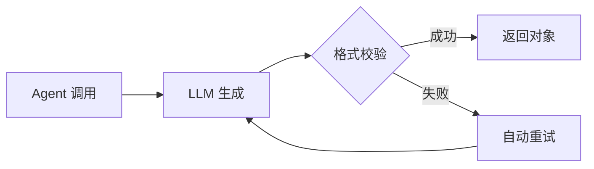

# 快速入门：30 分钟掌握 Nexa 基础

欢迎使用 Nexa！本教程将带你从零开始，在 30 分钟内掌握 Nexa 的核心概念和基本用法。

---

## 📋 前置准备

### 1. 环境要求

| 项目 | 要求 |
|-----|-----|
| Python | ≥ 3.10 |
| 操作系统 | Linux / macOS / Windows (WSL) |
| 内存 | ≥ 4GB |

### 2. 安装 Nexa

```bash
# 克隆仓库
git clone https://github.com/your-org/nexa.git
cd nexa

# 安装依赖（建议在虚拟环境中）
pip install -e .
```

### 3. 配置 API 密钥

Nexa 需要大语言模型的 API 密钥才能运行。创建 `secrets.nxs` 文件：

```bash
# 在项目根目录创建密钥文件
cat > secrets.nxs << 'EOF'
OPENAI_API_KEY = "sk-your-openai-key"
DEEPSEEK_API_KEY = "sk-your-deepseek-key"
MINIMAX_API_KEY = "your-minimax-key"
EOF
```

!!! warning "安全提示"
    - **永远不要**将 `secrets.nxs` 提交到 Git
    - 该文件已在 `.gitignore` 中配置，请确保它不被意外提交

### 4. 验证安装

```bash
# 检查安装是否成功
nexa --version

# 应输出类似：Nexa v1.3.x
```

### 5. 常用 CLI 命令速查

```bash
# 编译与运行
nexa build main.nexa          # 编译程序
nexa run main.nexa            # 运行程序
nexa test main.nexa           # 运行测试

# 分析与检查
nexa inspect main.nexa        # 结构分析
nexa validate main.nexa       # 语义验证
nexa lint main.nexa           # 类型系统 Lint (v1.3.1+)
nexa intent check main.nexa   # 意图检查 (v1.1+)
nexa intent coverage main.nexa # 意图覆盖率 (v1.1+)

# 服务与任务
nexa serve main.nexa          # 启动 HTTP Server (v1.3.4+)
nexa routes main.nexa         # 列出路由 (v1.3.4+)
nexa jobs main.nexa --all     # 任务管理 (v1.3.3+)
nexa workers main.nexa        # Worker 管理 (v1.3.3+)
nexa cache clear              # 清理缓存
```

---

## 🎯 核心概念速览

在开始写代码之前，让我们快速了解 Nexa 的三个核心概念：

### 概念 1：Agent（智能体）

**Agent 是什么？**

Agent 是 Nexa 中的"一等公民"，代表一个具有特定能力的 AI 助手。你可以把它理解为一个"角色"，它有：

- **角色设定**（role）：它是谁
- **系统提示**（prompt）：它该做什么
- **模型**（model）：它用哪个大模型
- **工具**（tools）：它能用什么工具（可选）

```nexa
// 最简单的 Agent 定义
agent Greeter {
    role: "友好的问候助手",
    prompt: "你是一个热情友好的助手，用简洁的语言帮助用户。",
    model: "deepseek/deepseek-chat"
}
```

### 概念 2：Flow（流程）

**Flow 是什么？**

Flow 是 Agent 的工作流程，是程序执行的入口点。类似于其他语言中的 `main` 函数。

```nexa
flow main {
    // 这里是程序的主体逻辑
    result = Greeter.run("你好！");
    print(result);
}
```

### 概念 3：Protocol（协议）

**Protocol 是什么？**

Protocol 用于约束 Agent 的输出格式，确保返回结构化数据。这在需要将 Agent 输出传递给其他系统时非常重要。

```nexa
// 定义一个输出协议
protocol UserInfo {
    name: "string",
    age: "int",
    interest: "string"
}

// Agent 实现该协议
agent InfoExtractor implements UserInfo {
    prompt: "从用户输入中提取个人信息"
}
```

---

## 🚀 练习 1：Hello World

让我们写第一个 Nexa 程序！

### 步骤 1：创建项目文件

```bash
mkdir -p my-first-nexa
cd my-first-nexa
```

### 步骤 2：编写代码

创建文件 `hello.nx`：

```nexa
// hello.nx - 你的第一个 Nexa 程序

// 定义一个简单的 Agent
agent HelloBot {
    role: "热情的问候机器人",
    prompt: "你是一个友好的助手。请用热情、简洁的语言回应用户，不超过50个字。",
    model: "deepseek/deepseek-chat"
}

// 主流程
flow main {
    // 调用 Agent
    response = HelloBot.run("你好，请介绍一下你自己！");
    
    // 输出结果
    print(response);
}
```

### 步骤 3：运行程序

```bash
nexa run hello.nx
```

### 预期输出

```
你好！我是 HelloBot，一个热情友好的 AI 助手！很高兴认识你，有什么我可以帮助你的吗？😊
```

!!! success "恭喜！"
    你已经成功运行了第一个 Nexa 程序！

---

## 🛠️ 练习 2：带工具的 Agent

在真实应用中，Agent 通常需要调用外部工具。让我们给 Agent 添加一个计算器工具。

### 完整代码

创建文件 `calculator.nx`：

```nexa
// calculator.nx - 带工具的 Agent 示例

// 定义工具（简化版）
tool Calculator {
    description: "执行数学计算，支持加减乘除",
    parameters: {
        "expression": "string  // 数学表达式，如 '2+3*4'"
    }
}

// 定义使用该工具的 Agent
agent MathAssistant uses Calculator {
    role: "数学助手",
    prompt: """
    你是一个数学助手。当用户需要进行计算时，使用 Calculator 工具。
    计算完成后，用简洁的语言解释结果。
    """,
    model: "deepseek/deepseek-chat"
}

flow main {
    // 用户提问
    question = "请帮我计算 (123 + 456) * 2 等于多少？"
    
    // Agent 处理
    result = MathAssistant.run(question)
    
    // 输出
    print(result)
}
```

### 运行

```bash
nexa run calculator.nx
```

### 预期输出

```
我来帮你计算：

(123 + 456) * 2 = 579 * 2 = 1158

答案是 1158。
```

### 代码解析

| 行号 | 代码 | 说明 |
|-----|------|-----|
| 4-9 | `tool Calculator {...}` | 定义一个工具，包含描述和参数 |
| 12 | `uses Calculator` | 告诉 Agent 它可以使用这个工具 |
| 24 | `MathAssistant.run(question)` | 让 Agent 处理用户问题 |

---

## 🔄 练习 3：多 Agent 协作

Nexa 的强大之处在于多 Agent 协作。让我们创建一个"翻译-校对"流水线。

### 完整代码

创建文件 `translation_pipeline.nx`：

```nexa
// translation_pipeline.nx - 多 Agent 协作示例

// 第一步：翻译
agent Translator {
    role: "专业翻译",
    prompt: "你是一个专业的英译中翻译。请将用户提供的英文翻译成流畅的中文，保持原意。",
    model: "deepseek/deepseek-chat"
}

// 第二步：校对
agent Proofreader {
    role: "中文校对",
    prompt: "你是一个中文校对专家。检查译文是否通顺、准确，如有问题请修正。",
    model: "deepseek/deepseek-chat"
}

flow main {
    // 原文
    english_text = "Artificial intelligence is transforming the way we live and work."
    
    // 方法一：逐步调用（易理解）
    // translated = Translator.run(english_text)
    // final_result = Proofreader.run(translated)
    
    // 方法二：管道操作符（推荐，更简洁）
    final_result = english_text >> Translator >> Proofreader
    
    print("原文：" + english_text)
    print("译文：" + final_result)
}
```

### 运行

```bash
nexa run translation_pipeline.nx
```

### 预期输出

```
原文：Artificial intelligence is transforming the way we live and work.
译文：人工智能正在改变我们生活和工作的方式。
```

### 管道操作符 `>>` 详解

```nexa
// 管道操作符将前一个 Agent 的输出传递给下一个 Agent
input >> AgentA >> AgentB >> AgentC

// 等价于：
temp1 = AgentA.run(input)
temp2 = AgentB.run(temp1)
result = AgentC.run(temp2)
```

!!! tip "最佳实践"
    当你有超过 2 个 Agent 串联时，推荐使用管道操作符，代码更清晰。

---

## 🎨 练习 4：意图路由

用户的请求多种多样，如何根据意图分发给不同的 Agent？使用 `match intent`！

### 完整代码

创建文件 `smart_router.nx`：

```nexa
// smart_router.nx - 意图路由示例

// 天气查询 Agent
agent WeatherBot {
    role: "天气助手",
    prompt: "你负责回答天气相关问题。提供简明、准确的天气信息。",
    model: "deepseek/deepseek-chat"
}

// 新闻查询 Agent
agent NewsBot {
    role: "新闻助手",
    prompt: "你负责回答新闻相关问题。提供最新、最重要的新闻概要。",
    model: "deepseek/deepseek-chat"
}

// 闲聊 Agent
agent ChatBot {
    role: "聊天伙伴",
    prompt: "你是一个友好的聊天伙伴，与用户进行日常对话。",
    model: "deepseek/deepseek-chat"
}

flow main {
    // 用户输入
    user_message = "今天北京天气怎么样？"
    
    // 意图路由
    response = match user_message {
        intent("查询天气") => WeatherBot.run(user_message),
        intent("查询新闻") => NewsBot.run(user_message),
        _ => ChatBot.run(user_message)  // 默认分支
    }
    
    print(response)
}
```

### 运行

```bash
nexa run smart_router.nx
```

### 预期输出

当用户输入"今天北京天气怎么样？"时：

```
北京今天天气晴朗，气温 15-25°C，空气质量良好，适合户外活动。
```

### 意图路由流程

```
用户输入
    ↓
┌─────────────────────┐
│   意图分类器（内置）  │
└─────────────────────┘
    ↓
┌─────┬─────┬─────┐
│天气 │新闻 │其他 │
└─────┴─────┴─────┘
    ↓     ↓     ↓
Weather News  Chat
 Bot    Bot   Bot
```

---

## 📊 练习 5：结构化输出（Protocol）

当你需要 Agent 返回特定格式的数据时，使用 `protocol`。

### 完整代码

创建文件 `structured_output.nx`：

```nexa
// structured_output.nx - 结构化输出示例

// 定义输出协议
protocol BookReview {
    title: "string",      // 书名
    author: "string",     // 作者
    rating: "int",        // 评分（1-10）
    summary: "string",    // 简介
    recommendation: "string"  // 推荐语
}

// 实现协议的 Agent
agent Reviewer implements BookReview {
    role: "书评人",
    prompt: """
    你是一位专业书评人。根据用户提供的书籍信息，给出结构化的评价。
    请确保输出严格的 JSON 格式。
    """,
    model: "deepseek/deepseek-chat"
}

flow main {
    // 请求书评
    book_name = "《三体》"
    result = Reviewer.run("请为" + book_name + "写一篇书评")
    
    // 结果已经是结构化对象，可以直接使用
    print("书名：" + result.title)
    print("作者：" + result.author)
    print("评分：" + result.rating + "/10")
    print("简介：" + result.summary)
    print("推荐：" + result.recommendation)
}
```

### 运行

```bash
nexa run structured_output.nx
```

### 预期输出

```
书名：三体
作者：刘慈欣
评分：9/10
简介：一部史诗级科幻小说，讲述了人类与三体文明的宏大对抗。
推荐：强烈推荐给所有科幻爱好者，这是中国科幻的里程碑之作！
```

### Protocol 工作原理



!!! success "自动修正机制"
    当 Agent 的输出不符合 Protocol 时，Nexa 会自动触发重试，将错误信息反馈给 LLM 要求修正。你不需要手动处理！

---

## ✅ 学习检查点

完成以上练习后，你应该能够：

- [ ] 创建和运行基本的 Nexa 程序
- [ ] 定义 Agent 并设置其属性
- [ ] 使用 `flow main` 作为程序入口
- [ ] 使用管道操作符 `>>` 串联多个 Agent
- [ ] 使用 `match intent` 实现意图路由
- [ ] 使用 `protocol` 约束输出格式

---

## 🎓 下一步学习

现在你已经掌握了 Nexa 的基础，建议继续学习：

1. **[基础语法](part1_basic.md)** - 深入了解 Agent 的所有属性
2. **[高级特性](part2_advanced.md)** - 学习 DAG 操作符、并发处理
3. **[语法扩展](part3_extensions.md)** - 掌握 Protocol 高级用法
4. **[完整示例集合](examples.md)** - 查看更多实战案例

---

## ❓ 常见问题

### Q1: 运行时提示 "API key not found"

确保 `secrets.nxs` 文件存在且包含正确的 API 密钥：

```bash
# 检查文件是否存在
ls secrets.nxs

# 查看内容（注意不要泄露）
cat secrets.nxs
```

### Q2: 模型调用失败

检查模型名称格式是否正确：

```nexa
// ✅ 正确格式：提供商/模型名
model: "deepseek/deepseek-chat"
model: "openai/gpt-4"

// ❌ 错误格式
model: "gpt-4"  // 缺少提供商前缀
model: "deepseek-chat"  // 格式错误
```

### Q3: 如何调试？

使用 `nexa build` 查看生成的 Python 代码：

```bash
nexa build hello.nx
# 会生成 out_hello.py 文件
```

### Q4: 更多问题？

查看 [常见问题与排查指南](troubleshooting.md) 获取更多帮助。

---

<div align="center">
  <p>🎉 恭喜完成快速入门！继续探索 Nexa 的无限可能吧！</p>
</div>